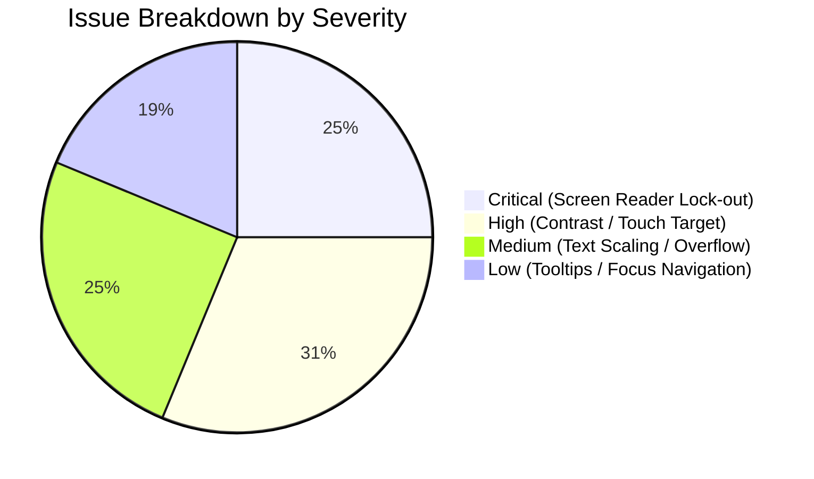
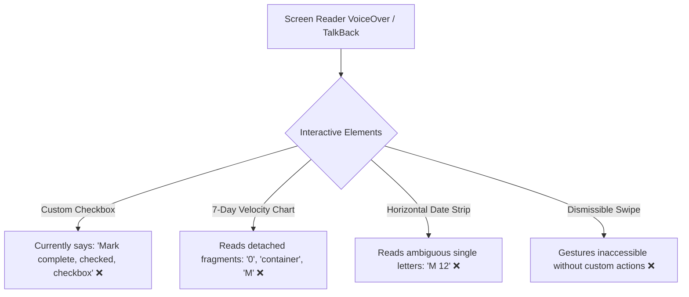
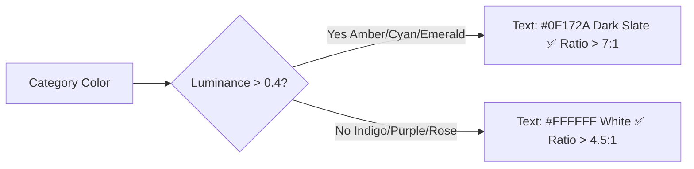
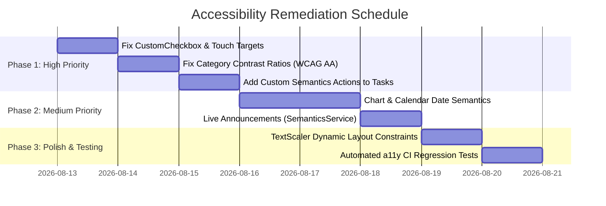

# Accessibility (a11y) Audit Report: Task Studio

**Application:** Task Studio (`task_manager`)  
**Codebase Path:** `/Users/jinhangyu/Desktop/task_manager`  
**Standards Evaluated:** WCAG 2.1 Level AA, Material Design 3 Accessibility Guidelines, Flutter Semantics Architecture  
**Audit Date:** August 12, 2026  

---

## 1. Executive Summary & Compliance Scorecard

This comprehensive accessibility review evaluates the Task Studio Flutter application across screen reader semantics, touch target geometry, color contrast ratios, dynamic text scaling, keyboard navigation, and auditory live state announcements.



### Compliance Overview

| Evaluation Category | WCAG 2.1 AA Ref | Status | Notes |
| :--- | :--- | :---: | :--- |
| **Non-text Content & Semantics** | 1.1.1 (Level A) | ⚠️ **Needs Fixes** | Custom charts, date strip, and checkbox lack complete semantic descriptions. |
| **Info and Relationships** | 1.3.1 (Level A) | ⚠️ **Needs Fixes** | Custom bar chart and stat cards read as detached tokens. |
| **Contrast (Minimum)** | 1.4.3 (Level AA) | ❌ **Failing** | White text on yellow/cyan category chips; dark mode secondary text contrast. |
| **Resize Text / Font Scaling** | 1.4.4 (Level AA) | ⚠️ **Needs Fixes** | Fixed height buttons (`SizedBox(height: 52)`) and non-wrapping duration chip rows. |
| **Keyboard Accessibility** | 2.1.1 (Level A) | ⚠️ **Needs Fixes** | Missing text input actions and custom semantics actions on dismissible cards. |
| **Target Size (Minimum)** | 2.5.5 (Level AAA) / Material | ❌ **Failing** | Checkboxes (32dp), popup menu buttons (32dp), and delete icon buttons (<48dp). |
| **Name, Role, Value** | 4.1.2 (Level A) | ⚠️ **Needs Fixes** | Category chips and custom checkboxes lack explicit toggle/selection semantics. |
| **Status Messages / Live Regions** | 4.1.3 (Level AA) | ⚠️ **Needs Fixes** | Task completion, deletion, and filter updates lack `SemanticsService.announce`. |

---

## 2. Detailed Findings & Actionable Remediation

### 2.1. Component Semantics & Screen Reader Interpretation



#### Issue 1: Ambiguous `CustomCheckbox` Semantics Label
- **File:** [lib/widgets/custom_checkbox.dart](file:///Users/jinhangyu/Desktop/task_manager/lib/widgets/custom_checkbox.dart#L63-L118)
- **Severity:** `Critical`
- **WCAG Reference:** 4.1.2 Name, Role, Value
- **Problem:**
  The `Semantics` widget assigns `label: widget.value ? 'Mark incomplete' : 'Mark complete'`. Because screen readers automatically append the checked state and control type, this causes announcements like:
  > *"Mark complete, checked, checkbox"*
  This is contradictory and disorienting. Furthermore, it lacks an explicit `onTap` semantic action handler.
- **Recommended Code Fix:**
```diff
--- a/lib/widgets/custom_checkbox.dart
+++ b/lib/widgets/custom_checkbox.dart
@@ -62,7 +62,11 @@ class _CustomCheckboxState extends State<CustomCheckbox>
     return Semantics(
       checked: widget.value,
-      label: widget.value ? 'Mark incomplete' : 'Mark complete',
+      label: widget.semanticLabel ?? (widget.value ? 'Completed' : 'Not completed'),
+      hint: widget.onChanged != null
+          ? (widget.value ? 'Double tap to mark incomplete' : 'Double tap to mark complete')
+          : null,
+      onTap: widget.onChanged != null ? () => widget.onChanged!(!widget.value) : null,
       child: Material(
         color: Colors.transparent,
```

---

#### Issue 2: Custom 7-Day Velocity Chart Missing Semantic Aggregation
- **File:** [lib/views/analytics_view.dart](file:///Users/jinhangyu/Desktop/task_manager/lib/views/analytics_view.dart#L188-L271)
- **Severity:** `Critical`
- **WCAG Reference:** 1.1.1 Non-text Content, 1.3.1 Info and Relationships
- **Problem:**
  The chart uses individual `Text` and `AnimatedContainer` elements in a `Row`. Screen readers announce: *"0"*, *"container"*, *"M"*, *"2"*, *"container"*, *"T"*, providing no context on what the values represent.
- **Recommended Code Fix:**
```diff
--- a/lib/views/analytics_view.dart
+++ b/lib/views/analytics_view.dart
@@ -187,6 +187,9 @@ class AnalyticsView extends StatelessWidget {
                       // Bar Chart
+                      Semantics(
+                        container: true,
+                        label: '7-Day Activity Velocity chart. ${controller.completedThisWeekCount} tasks completed this week.',
+                        child: SizedBox(
                         height: 140,
                         child: Row(
                           crossAxisAlignment: CrossAxisAlignment.end,
                           mainAxisAlignment: MainAxisAlignment.spaceAround,
                           children: history.entries.map((
                             MapEntry<DateTime, int> entry,
                           ) {
                             final DateTime date = entry.key;
                             final int count = entry.value;
+                            const List<String> fullDays = <String>[
+                              'Monday', 'Tuesday', 'Wednesday', 'Thursday', 'Friday', 'Saturday', 'Sunday'
+                            ];
+                            return Semantics(
+                              label: '${fullDays[date.weekday - 1]}: $count task${count == 1 ? '' : 's'} completed',
+                              excludeSemantics: true,
+                              child: Column(...),
+                            );
                           }).toList(),
                         ),
                       ),
+                      ),
```

---

#### Issue 3: Calendar Date Strip Missing Date & Task Density Semantics
- **File:** [lib/views/calendar_view.dart](file:///Users/jinhangyu/Desktop/task_manager/lib/views/calendar_view.dart#L142-L258)
- **Severity:** `Critical`
- **WCAG Reference:** 1.3.1 Info and Relationships, 4.1.2 Name, Role, Value
- **Problem:**
  Single-letter weekday headers (`M`, `T`, `W`, `T`, `F`, `S`, `S`) are ambiguous (`T` for Tuesday vs Thursday, `S` for Saturday vs Sunday). Screen readers read *"M, 12"* with no month or selection state.
- **Recommended Code Fix:**
```diff
--- a/lib/views/calendar_view.dart
+++ b/lib/views/calendar_view.dart
@@ -168,6 +168,13 @@ class _CalendarViewState extends State<CalendarView> {
                     return Padding(
                       padding: const EdgeInsets.only(right: 8.0),
+                      child: Semantics(
+                        button: true,
+                        selected: isSelected,
+                        label: '${weekdaysFull[date.weekday - 1]}, ${monthNames[date.month - 1]} ${date.day}${isToday ? ', Today' : ''}. $countOnDay task${countOnDay == 1 ? '' : 's'} scheduled.',
+                        hint: isSelected ? 'Currently selected' : 'Double tap to view tasks for this date',
+                        excludeSemantics: true,
                         child: InkWell(
                           onTap: () {
                             setState(() {
@@ -256,6 +263,7 @@ class _CalendarViewState extends State<CalendarView> {
                         ),
                       ),
                     );
```

---

#### Issue 4: `Dismissible` Swipe Actions Inaccessible via Assistive Tech
- **File:** [lib/widgets/task_card.dart](file:///Users/jinhangyu/Desktop/task_manager/lib/widgets/task_card.dart#L77-L143)
- **Severity:** `Critical`
- **WCAG Reference:** 2.1.1 Keyboard / Assistive Navigation
- **Problem:**
  Screen reader users navigating sequentially cannot execute swipe gestures without dedicated accessibility actions.
- **Recommended Code Fix:**
```diff
--- a/lib/widgets/task_card.dart
+++ b/lib/widgets/task_card.dart
@@ -76,6 +76,14 @@ class TaskCard extends StatelessWidget {
     final Color categoryColor = task.category.color;

+    return Semantics(
+      customSemanticsActions: <CustomSemanticsAction, VoidCallback>{
+        CustomSemanticsAction(label: task.isCompleted ? 'Mark incomplete' : 'Mark complete'): onToggleComplete,
+        const CustomSemanticsAction(label: 'Delete task'): onDelete,
+        CustomSemanticsAction(label: task.isPinned ? 'Unpin task' : 'Pin to top'): onTogglePin,
+        const CustomSemanticsAction(label: 'Duplicate task'): onDuplicate,
+      },
       child: Dismissible(
         key: ValueKey<String>('dismiss_${task.id}'),
         direction: DismissDirection.horizontal,
```

---

### 2.2. Touch Target Geometry (< 48x48 dp)

> [!IMPORTANT]
> Both Android Accessibility Guidelines and WCAG 2.5.5 Target Size require minimum 48x48 dp touch boundaries to accommodate motor impairments.

| Component | File & Line | Current Bounds | Required Minimum | Remediation |
| :--- | :--- | :---: | :---: | :--- |
| **`CustomCheckbox`** | [lib/widgets/custom_checkbox.dart:L73-L82](file:///Users/jinhangyu/Desktop/task_manager/lib/widgets/custom_checkbox.dart#L73-L82) | 32 x 32 dp | 48 x 48 dp | Wrap `InkWell` in `ConstrainedBox(constraints: BoxConstraints(minWidth: 48, minHeight: 48))` |
| **`PopupMenuButton` in TaskCard** | [lib/widgets/task_card.dart:L236-L240](file:///Users/jinhangyu/Desktop/task_manager/lib/widgets/task_card.dart#L236-L240) | 32 x 32 dp | 48 x 48 dp | Remove `constraints: BoxConstraints(minWidth: 32, maxWidth: 40)` |
| **`CategoryChip`** | [lib/widgets/category_chip.dart:L49](file:///Users/jinhangyu/Desktop/task_manager/lib/widgets/category_chip.dart#L49) | ~34 dp height | 48 dp height | Increase vertical padding or enforce `minHeight: 48` |
| **Subtask Inline Delete** | [lib/widgets/add_edit_task_sheet.dart:L469](file:///Users/jinhangyu/Desktop/task_manager/lib/widgets/add_edit_task_sheet.dart#L469) | 24 x 24 dp | 48 x 48 dp | Use standard `IconButton` with default padding |

---

### 2.3. Color Contrast Compliance (WCAG 2.1 AA)

> [!WARNING]
> WCAG 2.1 AA requires a contrast ratio of at least **4.5:1** for standard text and **3.0:1** for large text (>=18pt or 14pt bold) and interactive controls.



#### Contrast Analysis Table

| Element & State | Foreground Color | Background Color | Measured Ratio | WCAG AA Status | Remediation |
| :--- | :---: | :---: | :---: | :---: | :--- |
| **Selected Study Chip** ([lib/widgets/category_chip.dart:L93](file:///Users/jinhangyu/Desktop/task_manager/lib/widgets/category_chip.dart#L93)) | `#FFFFFF` | `#F59E0B` (Amber) | **2.15:1** | ❌ **FAIL** | Switch text color to `#0F172A` (Dark Slate: **8.3:1** ✅) |
| **Selected Development Chip** ([lib/widgets/filter_drawer.dart:L128](file:///Users/jinhangyu/Desktop/task_manager/lib/widgets/filter_drawer.dart#L128)) | `#FFFFFF` | `#06B6D4` (Cyan) | **2.32:1** | ❌ **FAIL** | Switch text color to `#0F172A` (Dark Slate: **7.8:1** ✅) |
| **Selected Fitness Chip** ([lib/widgets/add_edit_task_sheet.dart:L282](file:///Users/jinhangyu/Desktop/task_manager/lib/widgets/add_edit_task_sheet.dart#L282)) | `#FFFFFF` | `#10B981` (Emerald) | **2.65:1** | ❌ **FAIL** | Switch text color to `#0F172A` (Dark Slate: **6.9:1** ✅) |
| **Completed Task Title (Dark Mode)** ([lib/widgets/task_card.dart:L329](file:///Users/jinhangyu/Desktop/task_manager/lib/widgets/task_card.dart#L329)) | `Colors.white38` | `#1E293B` (Card Dark) | **2.70:1** | ❌ **FAIL** | Use `Colors.white60` (**5.2:1** ✅) |
| **Completed Task Title (Light Mode)** ([lib/widgets/task_card.dart:L331](file:///Users/jinhangyu/Desktop/task_manager/lib/widgets/task_card.dart#L331)) | `#94A3B8` (Slate-400) | `#FFFFFF` (Card Light) | **2.89:1** | ❌ **FAIL** | Use `#64748B` (Slate-500: **4.6:1** ✅) |
| **Streak Icon on Stats Banner** ([lib/widgets/stats_card.dart:L134](file:///Users/jinhangyu/Desktop/task_manager/lib/widgets/stats_card.dart#L134)) | `#FBBF24` (Amber) | `#4F46E5` (Indigo) | **2.80:1** | ❌ **FAIL** | Lighten icon or use white badge backing |

---

### 2.4. Dynamic Text Scaling (`TextScaler`) & Overflow Prevention

When users enable large accessibility font scaling (e.g. 1.5x or 2.0x):

1. **Fixed-Height Save/Create Task Buttons**:
   - [lib/widgets/add_edit_task_sheet.dart:L560](file:///Users/jinhangyu/Desktop/task_manager/lib/widgets/add_edit_task_sheet.dart#L560) (`SizedBox(height: 52)`) and [lib/widgets/filter_drawer.dart:L206](file:///Users/jinhangyu/Desktop/task_manager/lib/widgets/filter_drawer.dart#L206) (`SizedBox(height: 48)`).
   - *Fix:* Replace `SizedBox(height: ...)` with `ConstrainedBox(constraints: const BoxConstraints(minHeight: 52))`.
2. **Duration Estimate Chips Row**:
   - [lib/widgets/add_edit_task_sheet.dart:L381-L403](file:///Users/jinhangyu/Desktop/task_manager/lib/widgets/add_edit_task_sheet.dart#L381-L403): Row of duration chips overflows horizontally at high text scales.
   - *Fix:* Wrap in `SingleChildScrollView(scrollDirection: Axis.horizontal)` or `Wrap(spacing: 6, runSpacing: 6)`.
3. **Category Grid Aspect Ratio**:
   - [lib/views/categories_view.dart:L137](file:///Users/jinhangyu/Desktop/task_manager/lib/views/categories_view.dart#L137): `childAspectRatio: 1.1` causes card content clipping at >= 1.4x font scale.
   - *Fix:* Compute `childAspectRatio` dynamically based on `MediaQuery.textScalerOf(context).scale(1.0)`.

---

### 2.5. Missing Tooltips & Keyboard Actions

Add explicit `tooltip` parameters to:
- **Modal Close Buttons:** [lib/widgets/add_edit_task_sheet.dart:L210](file:///Users/jinhangyu/Desktop/task_manager/lib/widgets/add_edit_task_sheet.dart#L210), [lib/widgets/task_details_sheet.dart:L158](file:///Users/jinhangyu/Desktop/task_manager/lib/widgets/task_details_sheet.dart#L158), [lib/widgets/settings_sheet.dart:L46](file:///Users/jinhangyu/Desktop/task_manager/lib/widgets/settings_sheet.dart#L46), [lib/views/categories_view.dart:L62](file:///Users/jinhangyu/Desktop/task_manager/lib/views/categories_view.dart#L62).
- **Search Clear Button:** [lib/views/tasks_view.dart:L181](file:///Users/jinhangyu/Desktop/task_manager/lib/views/tasks_view.dart#L181).
- **Subtask Delete Buttons:** [lib/widgets/add_edit_task_sheet.dart:L469](file:///Users/jinhangyu/Desktop/task_manager/lib/widgets/add_edit_task_sheet.dart#L469), [lib/widgets/task_details_sheet.dart:L344](file:///Users/jinhangyu/Desktop/task_manager/lib/widgets/task_details_sheet.dart#L344).
- **Text Form Field Actions:** Add `textInputAction: TextInputAction.next` to task title in [lib/widgets/add_edit_task_sheet.dart:L220](file:///Users/jinhangyu/Desktop/task_manager/lib/widgets/add_edit_task_sheet.dart#L220).

---

### 2.6. Live Screen Reader State Announcements

Integrate `SemanticsService.announce` in [lib/controllers/task_controller.dart](file:///Users/jinhangyu/Desktop/task_manager/lib/controllers/task_controller.dart) to confirm asynchronous user operations:

```dart
import 'package:flutter/rendering.dart';

void toggleTaskCompletion(String taskId) {
  ...
  SemanticsService.announce(
    task.isCompleted ? '${task.title} marked as completed' : '${task.title} marked as incomplete',
    TextDirection.ltr,
  );
}

void deleteTask(String taskId) {
  ...
  SemanticsService.announce('Task deleted', TextDirection.ltr);
}
```

---

## 3. Automated Accessibility Test Suite

Add the following regression tests to [test/widget_test.dart](file:///Users/jinhangyu/Desktop/task_manager/test/widget_test.dart) to automatically validate compliance in CI:

```dart
// test/widget_test.dart
import 'package:flutter_test/flutter_test.dart';
import 'package:task_manager/main.dart';

void main() {
  testWidgets('Task Studio meets Flutter accessibility guidelines', (
    WidgetTester tester,
  ) async {
    final SemanticsHandle handle = tester.ensureSemantics();
    await tester.pumpWidget(const TaskManagementApp());
    await tester.pumpAndSettle();

    // Verify tap targets (48x48 Android / 44x44 iOS)
    await expectLater(tester, meetsGuideline(androidTapTargetGuideline));
    await expectLater(tester, meetsGuideline(iOSTapTargetGuideline));

    // Verify labeled interactive elements
    await expectLater(tester, meetsGuideline(labeledTapTargetGuideline));

    // Verify text contrast ratios
    await expectLater(tester, meetsGuideline(textContrastGuideline));

    handle.dispose();
  });
}
```

---

## 4. Prioritized Implementation Roadmap


